# Midnight Aurora Theme for Firefox


## Description

Midnight Aurora is a sophisticated Firefox theme inspired by the mesmerizing dance of the aurora borealis in a starry night sky. This sleek, dark theme transforms your browser with deep blues and vibrant teals, creating a visually stunning and eye-friendly browsing environment.

## Features

- 🌙 **Soothing Dark Mode**: Easy on the eyes, perfect for night browsing
- 🎨 **Aurora-Inspired Colors**: Deep blues and vibrant teals mimic the northern lights
- ✨ **Carefully Crafted Details**: Every element designed for a cohesive experience

## Installation

1. Visit the [Midnight Aurora Theme page](https://addons.mozilla.org/firefox/addon/midnight-aurora/) on the Firefox Add-ons website (currently in review).
2. Click the "Add to Firefox" button.
3. Follow the prompts to install the theme.
4. Enjoy your new Aurora-inspired browsing experience!

## Development

To modify or contribute to this theme:

1. Clone this repository:

    ```bash
    git clone https://github.com/Dor-sketch/midnight-aurora-theme.git
    ```

2. Make your changes to the `manifest.json` file.

3. Test your changes locally by loading the theme as a temporary add-on in Firefox:
    - Navigate to `about:debugging#/runtime/this-firefox`
    - Click "Load Temporary Add-on"
    - Select the `manifest.json` file from your cloned repository

## Color Scheme

[](./images/midnight-aurora-colors.svg)



- Header area background: 
- Header area text and icons: 
- Toolbar area background: 
- Toolbar area text and icons: 
- Toolbar field area background: 
- Toolbar field area text: 
- Tab highlight: 

Notes:

- These colors are designed to create a dark, aurora-inspired theme.
- The dark blues (#0a0f23, #161c32, #0f1428) represent the night sky.
- The light blue (#e0f2ff) and white (#ffffff) provide contrast for text and icons.
- The teal color (#00ffaa) represents the aurora and is used as an accent color for the tab highlight.

## Contributing

Contributions are welcome! If you have ideas for improvements or find any issues, please open an issue or submit a pull request.

## License

This project is licensed under the [MIT License](LICENSE).

## Author

- [Dor Pascal](https://github.com/Dor-sketch)

## Links

- [Firefox Add-ons Page](https://addons.mozilla.org/firefox/addon/midnight-aurora/)
- [Personal Website](https://dorpascal.com/midnight-aurora-theme/)

---

Enjoy the ethereal beauty of the northern lights in your browser with Midnight Aurora! 🌌
